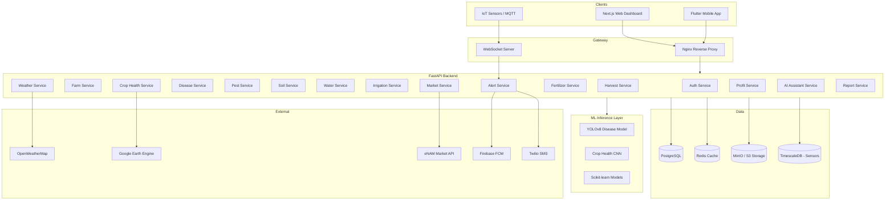
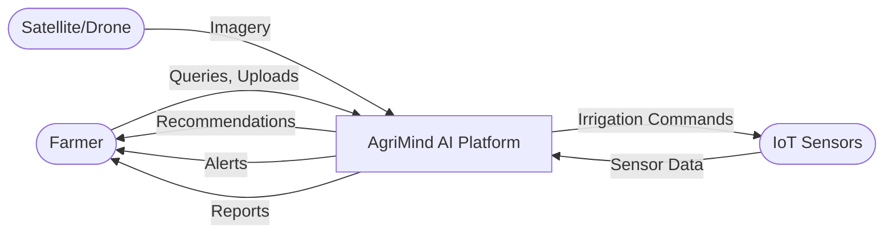
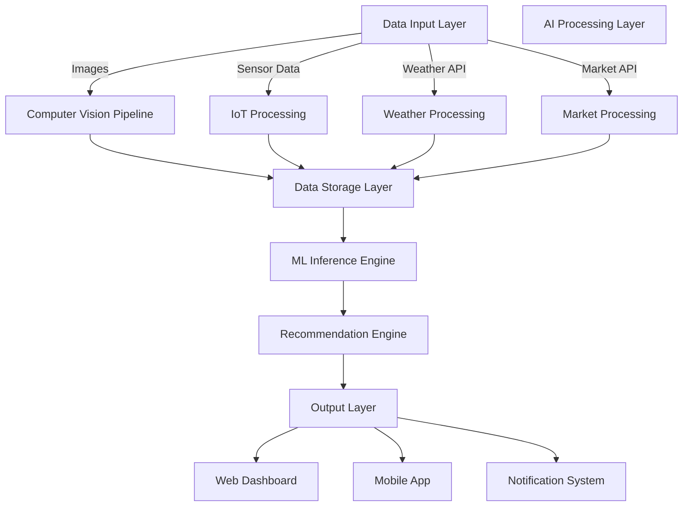

# System Architecture – AgriMind AI

## 1. High-Level Architecture



---

## 2. Microservice Architecture

The backend is organized as a **modular monolith** with clear service boundaries, deployable as a single unit (development) or split into microservices (production scale).

| Service | Responsibility | Dependencies |
|---------|---------------|--------------|
| **auth-service** | JWT auth, RBAC, user management | PostgreSQL, Redis |
| **farm-service** | Farm/field CRUD, GIS boundaries | PostgreSQL |
| **crop-health-service** | Image upload, NDVI, health scoring | ML Layer, S3, GEE |
| **disease-service** | Image analysis, treatment DB | YOLOv8, PostgreSQL |
| **pest-service** | Risk prediction, outbreak dates | Scikit-learn, Weather |
| **soil-service** | Sensor analysis, health scoring | PostgreSQL, IoT |
| **water-service** | ET calculation, requirement prediction | Scikit-learn, Weather, IoT |
| **irrigation-service** | Schedule generation, efficiency | Water Service, IoT |
| **alert-service** | Notification routing | FCM, Twilio, SMTP, WebSocket |
| **weather-service** | Forecast caching, impact analysis | OpenWeatherMap, Redis |
| **fertilizer-service** | NPK recommendations | Soil Service, Crop DB |
| **harvest-service** | Maturity prediction, yield estimation | ML, Weather, Satellite |
| **market-service** | Price fetching, sell/store analysis | eNAM, Scikit-learn |
| **profit-service** | Cost/profit scenario modeling | Market, Harvest Services |
| **assistant-service** | NLP query routing, voice | All Services, LLM |
| **report-service** | PDF/Excel/CSV generation | All Services |
| **iot-service** | MQTT ingestion, sensor management | TimescaleDB, WebSocket |

---

## 3. Data Flow Diagram (DFD – Level 0)



### DFD Level 1 – Processing



---

## 4. Deployment Architecture

```mermaid
graph TB
    subgraph AWS/Azure Cloud
        LB[Load Balancer]
        
        subgraph App Tier
            API1[API Server 1]
            API2[API Server 2]
            WS1[WebSocket Server]
        end

        subgraph ML Tier
            ML1[ML Inference Pod]
            ML2[ML Inference Pod]
        end

        subgraph Data Tier
            PG_PRIMARY[(PostgreSQL Primary)]
            PG_REPLICA[(PostgreSQL Replica)]
            REDIS_CLUSTER[(Redis Cluster)]
            S3_BUCKET[(Object Storage)]
        end

        subgraph Monitoring
            PROM[Prometheus]
            GRAF[Grafana]
            LOG[ELK Stack]
        end
    end

    CDN[CloudFront CDN] --> LB
    LB --> App Tier
    App Tier --> ML Tier
    App Tier --> Data Tier
    App Tier --> Monitoring
```

---

## 5. Security Architecture

```
┌─────────────────────────────────────────────┐
│                  WAF / CDN                   │
├─────────────────────────────────────────────┤
│              TLS 1.3 Termination             │
├─────────────────────────────────────────────┤
│         Rate Limiter (100 req/min)           │
├─────────────────────────────────────────────┤
│         JWT Validation Middleware           │
├─────────────────────────────────────────────┤
│         RBAC Authorization Layer            │
├─────────────────────────────────────────────┤
│    Input Validation (Pydantic Schemas)      │
├─────────────────────────────────────────────┤
│         Application Services                 │
├─────────────────────────────────────────────┤
│    Encrypted DB Connections (SSL)           │
├─────────────────────────────────────────────┤
│    Secrets Manager (AWS/Azure Key Vault)    │
└─────────────────────────────────────────────┘
```

---

## 6. Technology Stack

| Layer | Technology | Justification |
|-------|-----------|---------------|
| Frontend | Next.js 14, TypeScript, Tailwind CSS | SSR, performance, modern UI |
| Mobile | Flutter 3.x, Dart | Cross-platform, offline support |
| Backend | FastAPI, Python 3.11 | Async, auto-docs, ML ecosystem |
| Database | PostgreSQL 15, TimescaleDB | ACID, time-series for sensors |
| Cache | Redis 7 | Session, weather cache, rate limiting |
| ML | PyTorch, TensorFlow, Scikit-learn | Industry standard frameworks |
| CV | OpenCV, YOLOv8 (Ultralytics) | State-of-art object detection |
| GIS | Leaflet, PostGIS | Open-source mapping |
| Remote Sensing | Google Earth Engine, Sentinel-2 | Free satellite data |
| Message Queue | Redis Pub/Sub / MQTT | Real-time IoT ingestion |
| Storage | MinIO / AWS S3 | Image and report storage |
| CI/CD | GitHub Actions | Automated testing and deployment |
| Containers | Docker, Docker Compose | Consistent environments |
| Monitoring | Prometheus, Grafana | Metrics and alerting |

---

## 7. Scalability Strategy

1. **Horizontal Scaling:** API servers behind load balancer
2. **Database:** Read replicas for analytics; connection pooling via PgBouncer
3. **Caching:** Redis for weather data (1hr TTL), market prices (30min TTL)
4. **ML Inference:** Separate GPU pods with model caching
5. **CDN:** Static assets and processed satellite imagery
6. **Async Processing:** Background tasks for report generation and batch ML

---

## 8. Disaster Recovery

- **RPO:** 1 hour (database backups every 6 hours + WAL archiving)
- **RTO:** 30 minutes (automated failover to replica)
- **Backup Strategy:** Daily full backup + continuous WAL streaming
- **Multi-region:** Optional secondary region for critical deployments
