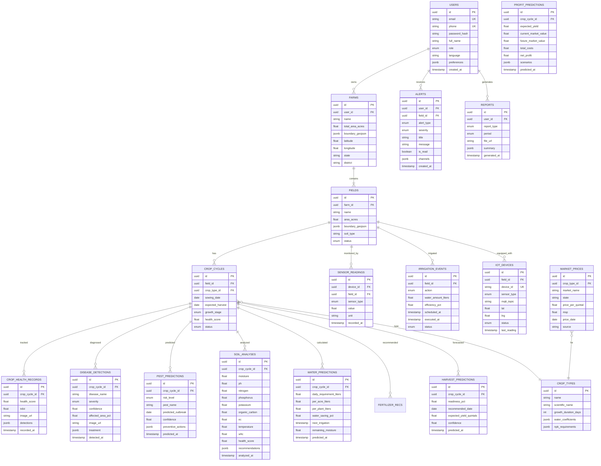

# Database Design – AgriMind AI

## 1. Entity Relationship Diagram



---

## 2. Database Schema (PostgreSQL)

See `backend/alembic/versions/` for migration files and `backend/app/models/` for SQLAlchemy ORM definitions.

### Key Indexes

```sql
CREATE INDEX idx_sensor_readings_time ON sensor_readings (field_id, recorded_at DESC);
CREATE INDEX idx_alerts_user_unread ON alerts (user_id, is_read, created_at DESC);
CREATE INDEX idx_crop_cycles_field ON crop_cycles (field_id, status);
CREATE INDEX idx_market_prices_crop_date ON market_prices (crop_type_id, price_date DESC);
CREATE INDEX idx_disease_detections_cycle ON disease_detections (crop_cycle_id, detected_at DESC);
```

### PostGIS Extension

```sql
CREATE EXTENSION IF NOT EXISTS postgis;
CREATE EXTENSION IF NOT EXISTS "uuid-ossp";

-- Spatial index on farm boundaries
CREATE INDEX idx_farms_boundary ON farms USING GIST (ST_GeomFromGeoJSON(boundary_geojson));
```

---

## 3. Data Dictionary

### Users Table
| Column | Type | Description |
|--------|------|-------------|
| role | ENUM | farmer, agronomist, admin |
| language | VARCHAR(10) | Preferred UI language (en, hi, ta, te, kn, mr) |
| preferences | JSONB | Notification settings, units, theme |

### Crop Types – Water Coefficients (JSONB)
```json
{
  "initial": 0.3,
  "development": 0.7,
  "mid_season": 1.15,
  "late_season": 0.8,
  "kc_values": [0.4, 0.7, 1.05, 0.85]
}
```

### Disease Detection – Treatment (JSONB)
```json
{
  "medicine": "Mancozeb 75% WP",
  "dosage": "2.5 g/L",
  "application": "Foliar spray every 10 days",
  "prevention": ["Crop rotation", "Resistant varieties", "Proper spacing"]
}
```

---

## 4. TimescaleDB (Sensor Time-Series)

```sql
-- Hypertable for high-frequency sensor data
SELECT create_hypertable('sensor_readings', 'recorded_at');

-- Continuous aggregate for hourly averages
CREATE MATERIALIZED VIEW sensor_hourly_avg
WITH (timescaledb.continuous) AS
SELECT field_id, sensor_type,
       time_bucket('1 hour', recorded_at) AS bucket,
       AVG(value) AS avg_value,
       MIN(value) AS min_value,
       MAX(value) AS max_value
FROM sensor_readings
GROUP BY field_id, sensor_type, bucket;
```

---

## 5. Redis Cache Keys

| Key Pattern | TTL | Purpose |
|-------------|-----|---------|
| `weather:{lat}:{lng}` | 1 hour | Cached weather forecast |
| `market:{crop}:{state}` | 30 min | Market prices |
| `session:{user_id}` | 24 hours | User session data |
| `ratelimit:{user_id}` | 1 min | API rate limiting |
| `health:{field_id}` | 15 min | Latest crop health score |
