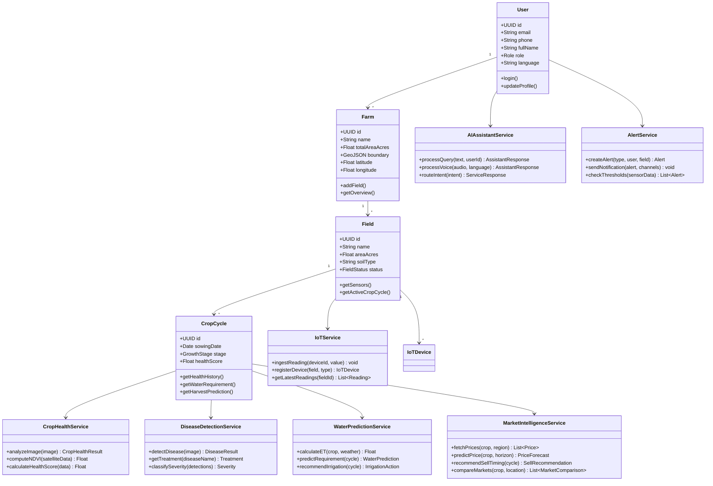
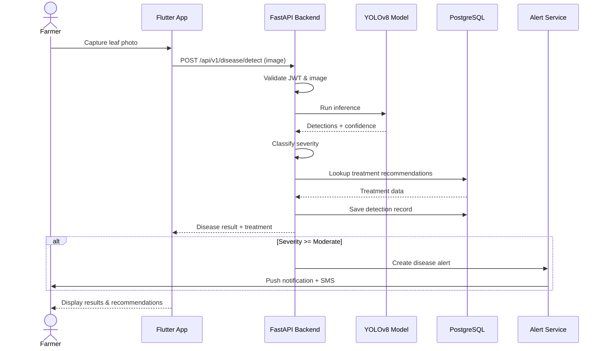
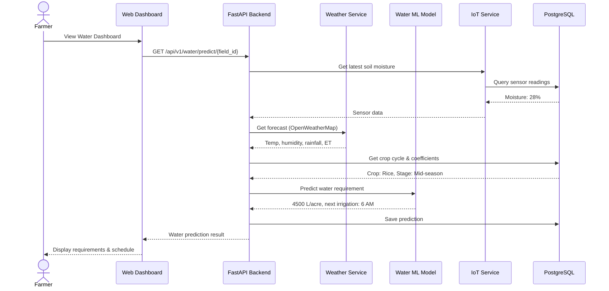
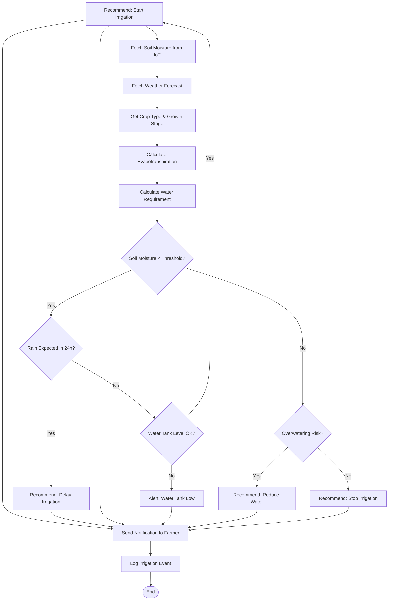
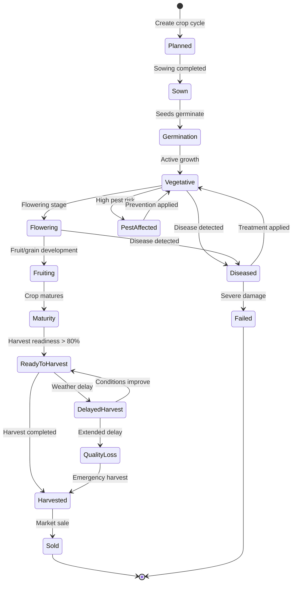
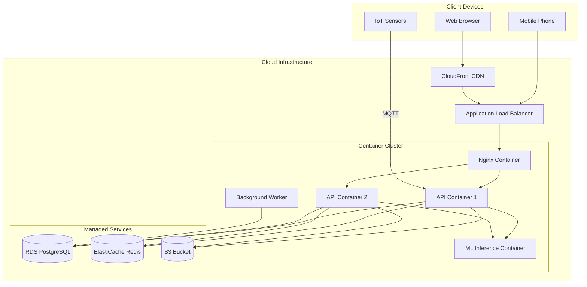

# UML Diagrams – AgriMind AI

## 1. Use Case Diagram

```mermaid
graph TB
    Farmer((Farmer))
    Admin((Admin))
    Agronomist((Agronomist))
    IoTDevice((IoT Device))

    subgraph Authentication
        UC1[Register / Login]
        UC2[Manage Profile]
    end

    subgraph Farm Management
        UC3[Create Farm & Fields]
        UC4[View GIS Map]
        UC5[Manage Crop Cycles]
    end

    subgraph Monitoring
        UC6[Monitor Crop Health]
        UC7[Scan for Diseases]
        UC8[View Pest Risk]
        UC9[Analyze Soil Health]
    end

    subgraph Water Management
        UC10[Calculate Water Requirement]
        UC11[Get Irrigation Schedule]
        UC12[Receive Water Alerts]
    end

    subgraph Intelligence
        UC13[View Weather Forecast]
        UC14[Get Fertilizer Recommendations]
        UC15[Predict Harvest Date]
        UC16[Analyze Market Prices]
        UC17[Predict Profit]
    end

    subgraph Assistant
        UC18[Ask AI Assistant]
        UC19[Voice Query]
    end

    subgraph Reports
        UC20[Generate Reports]
        UC21[Export PDF/Excel]
    end

    subgraph AdminOps
        UC22[Manage Users]
        UC23[Manage ML Models]
        UC24[System Monitoring]
    end

    Farmer --> UC1 & UC2 & UC3 & UC4 & UC5
    Farmer --> UC6 & UC7 & UC8 & UC9
    Farmer --> UC10 & UC11 & UC12
    Farmer --> UC13 & UC14 & UC15 & UC16 & UC17
    Farmer --> UC18 & UC19 & UC20 & UC21

    Admin --> UC22 & UC23 & UC24
    Agronomist --> UC6 & UC7 & UC8 & UC9 & UC14
    IoTDevice --> UC12
```



---

## 2. Class Diagram



---

## 3. Sequence Diagram – Disease Detection Flow



---

## 4. Sequence Diagram – Water Prediction Flow



---

## 5. Activity Diagram – Irrigation Decision



---

## 6. State Diagram – Crop Cycle Lifecycle



---

## 7. Component Diagram

```mermaid
graph TB
    subgraph Presentation Layer
        WEB[Next.js Dashboard]
        MOB[Flutter Mobile App]
    end

    subgraph API Layer
        GATEWAY[FastAPI Gateway]
        AUTH_MW[Auth Middleware]
        WS_SERVER[WebSocket Server]
    end

    subgraph Service Layer
        SVC_AUTH[Auth Service]
        SVC_FARM[Farm Service]
        SVC_HEALTH[Crop Health Service]
        SVC_DISEASE[Disease Service]
        SVC_WATER[Water Service]
        SVC_MARKET[Market Service]
        SVC_ALERT[Alert Service]
        SVC_ASSIST[AI Assistant]
        SVC_REPORT[Report Service]
        SVC_IOT[IoT Service]
    end

    subgraph ML Layer
        ML_DISEASE[YOLOv8 Engine]
        ML_PREDICT[Scikit-learn Engine]
        ML_HEALTH[CNN Engine]
    end

    subgraph Data Layer
        DB[(PostgreSQL)]
        CACHE[(Redis)]
        STORAGE[(S3/MinIO)]
    end

    subgraph External
        EXT_WEATHER[OpenWeatherMap]
        EXT_MARKET[eNAM API]
        EXT_NOTIFY[FCM / Twilio]
    end

    WEB --> GATEWAY
    MOB --> GATEWAY
    GATEWAY --> AUTH_MW
    AUTH_MW --> Service Layer
    WS_SERVER --> SVC_ALERT
    SVC_HEALTH --> ML_DISEASE
    SVC_DISEASE --> ML_DISEASE
    SVC_WATER --> ML_PREDICT
    SVC_MARKET --> ML_PREDICT
    SVC_MARKET --> EXT_MARKET
    SVC_ALERT --> EXT_NOTIFY
    Service Layer --> Data Layer
    SVC_IOT --> WS_SERVER
```

---

## 8. Deployment Diagram


